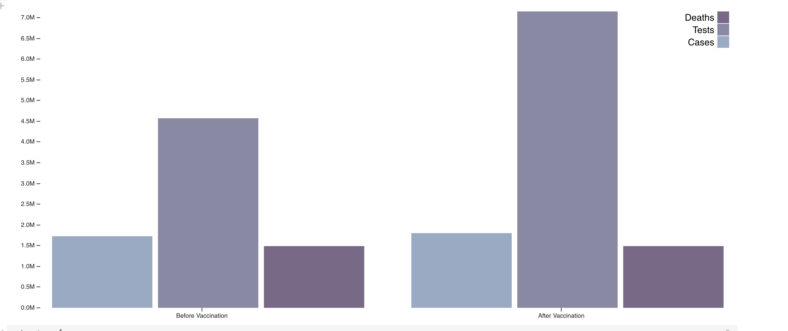
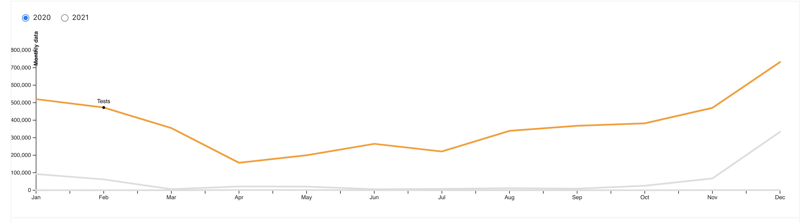
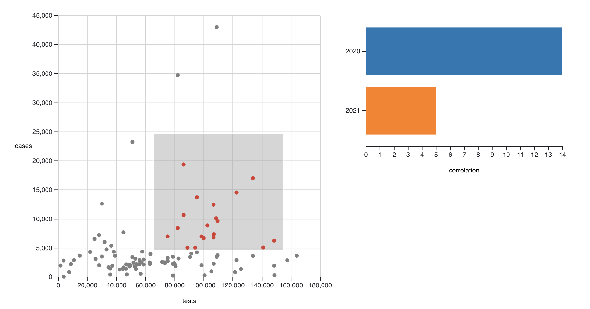
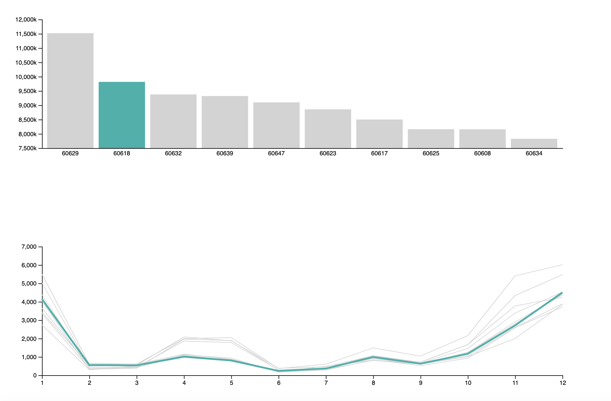
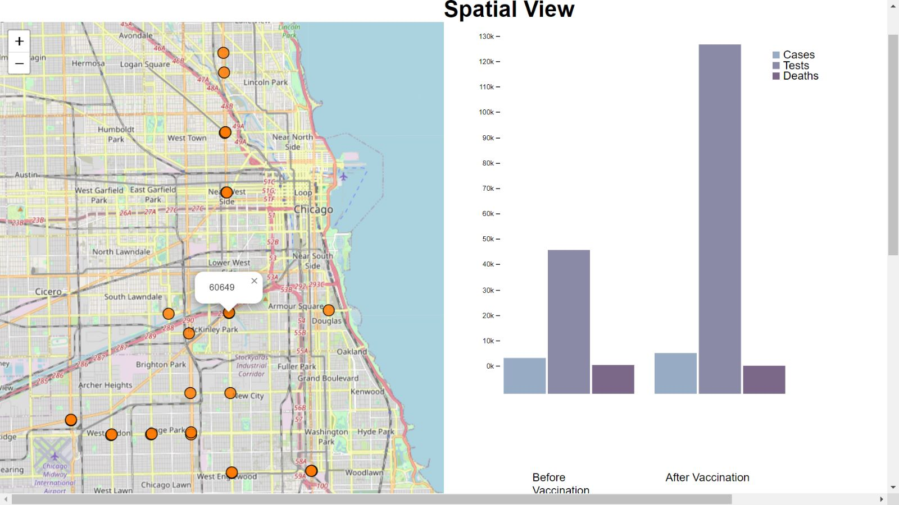

# CS 424 Project 3 - Report

# COVID - 19 Tests, Cases and Deaths Analysis

## Kushal Reddy Palvai (UIN: 677379211) | Ramiya Shree Seshaiah (UIN: 660418618)

## Webpage -  [Link](https://uic-vis.github.io/project3-covid-data-analysis/) 

The Dataset that we have used over here is related to COVID-19 cases, tests and deaths. The time period in the data set is from march 2020 to september 2022. Data owner is the Department of Public Health in chicago. We have the city of chicago with zip codes. There are 8040 records with each row representing a week. There are also 21 fields representing different attributes. The attributes present here are Row ID, Zipcode, Week, Week start, Week end, Cases/Tests/Death weekly & cumulative, population and percentage positive tests weekly & cumulative. 

For Data Preprocessing, Using Pandas, we first formatted both the data and time data. Week number is used to find if there is any missing field. Percentage tested positive is used to find if there are any missing number of cases. All null values are removed from the data. It's a numerical dataset and there are multiple categories for an attribute. We are currently focused on COVID data before and after vaccination, we aggregate data by weekly and monthly. Our main goal is to analyze what impact did vaccination have on COVID - 19. 

The goal of this project is to get an hands-on experience on interactive visual data exploration. We have used JavaScript, D3, and Observable to import, transform, visualize and interactively analyze a dataset.

Authors :
Ramiya Shree Seshaiah
Kushal Palvai Reddy

Problem : COVID - 19 has made a huge impact in everyone's life but vaccination has helped tremendously to get back to the normal life. So, in this project we are doing to compare pre and post vaccination data. 

## Domain Question - What impact did vaccination have on COVID-19? 

## Data Question - What effects did vaccination have on the COVID-19 cases, tests and deaths ? 

This is to compare the cases, tests and deaths before and after vaccination for which we have visualized the comparison using bar charts that can be seen in the following screenshot. 

Observable link - [Question 1](https://observablehq.com/d/68c0816015b4e9e1)

  

We can say that the Number of COVID tests taken have been increased drastically after a majority of people have been vaccinated. The Number of COVID cases have been escalated while the number of deaths are almost the same. COVID Deaths to Cases ratio have been significantly diminished after Vaccination.

## Data Question - Does COVID-19 Tests/Cases trend changes during the winters when comparing to other seasons ?

We have used single view interactive visualization technique to answer question 2 which goes over the COVID Cases, Tests and deaths across the months. In this visualization, When the year(2020 - before vaccination) or (2021 - after vaccination) is selected the line chart is ploted by manipulating the data while filtering across the years. 

Observable link - [Question 2](https://observablehq.com/d/bf8d22fd36977318)

The number of COVID tests and cases is significantly higher during the winter months, we found this by aggregating the data by monthly. The number of deaths as well can see a slight spike in the months of December & January. We can see how the COVID-19 trend changes during different seasons throughout the year. 

## Data Question - What is the correlation between covid 19 cases and tests between 2020 and 2021 ? 

We have used multiple linked view interactive visualization technique to depict the correlation between tests and cases in which the data points aggregated by week is brushed and the visual mapping of bar chart is manipulated.

Observable link - [Question 3](https://observablehq.com/d/edb9ee7f64351225)

 

In this visualization we can see the correlation between COVID tests and cases in the years 2020 and 2021. We can clearly interpret that the 2021 weeks (red points) have a much greater tests to cases ratio when compared to the weeks in 2020 (black points). 

We can observe that a scatterplot brush causes the bar chart to automatically update with only counts from chosen spots. We have manipulated the visual mapping and by brushing the selected points we can see the tests to cases ratio in the bar chart.

## Data Question - Which zipcodes in Chicago have the highest number of COVID cases & How does the trend vary accross different months ?

We have used Hover interactive visualization technique to answer question 4 where we can find the zipcodes(regions) with highest number of COVID Cases. We can click and select a zipcode, which further shows the COVID 19 cases trend across the 12 months.

Observable link - [Question 4](https://observablehq.com/d/011c1493ff967ccc)

In this visualization we can see the zipcodes(regions) with highest number of COVID 19 cases in chicago.  We can clearly interpret that the regions in downtown of chicago have much higher COVID cases when compared to other regions because of higher population density in chicago downtown.

Once we've selected a zipcode, we can clearly see how the COVID 19 cases trend vary accross different months. For all the zipcodes that we have, we can interpret that the months of winter (Nov, Dec & Jan) have higher COVID 19 cases when compared to other months. 

## Data Question - How COVID 19 tests,cases & deaths vary before and after vaccination in different regions of chicago ?

We have used Spatial interactive visualization technique to answer question 5 where we can find the zipcodes(regions) in chicago and when we select a zipcode, we can see how the COVID 19 tests, cases & deaths vary before and after vaccination. 

Website link - [Question 5](https://uic-vis.github.io/project3-covid-data-analysis/vis1.html)

In this visualization we can see how the COVID 19 tests, cases & deaths trend changes before and after vaccination in different zipcodes(regions). We can select different zipcodes(regions) and see how the COVID 19 tests,cases & deaths before and after vaccination for those specific zipcodes. 

From here we can interpret that for most of the zipcodes(regions) the Number of COVID tests taken have been increased drastically after a majority of people have been vaccinated. The Number of COVID cases have been escalated while the number of deaths are almost the same. COVID Deaths to Cases ratio have been significantly diminished after Vaccination.

## Conclusion 

As per our analysis, we can clearly see a rise in COVID 19 tests, cases & deaths during the months of winter as WHO confirmed COVID 19 tranmission is the highest during these months. Along with that, The regions in the downtown of chicago have higher COVID cases when compared to other regions. Number of COVID tests taken have been increased significantly after a majority of people have been vaccinated. COVID Deaths to Cases ratio have been significantly diminished after Vaccination. 

## Acknowledgements
[Andrew Burks](https://andrewtburks.dev/) for creating the starter code.

[Scivis Contest](https://www.uni-kl.de/sciviscontest/)

[img_cylinder]: https://github.com/uic-evl/cs529-vds/blob/master/imgs/cylinder.png "Cylinder"
